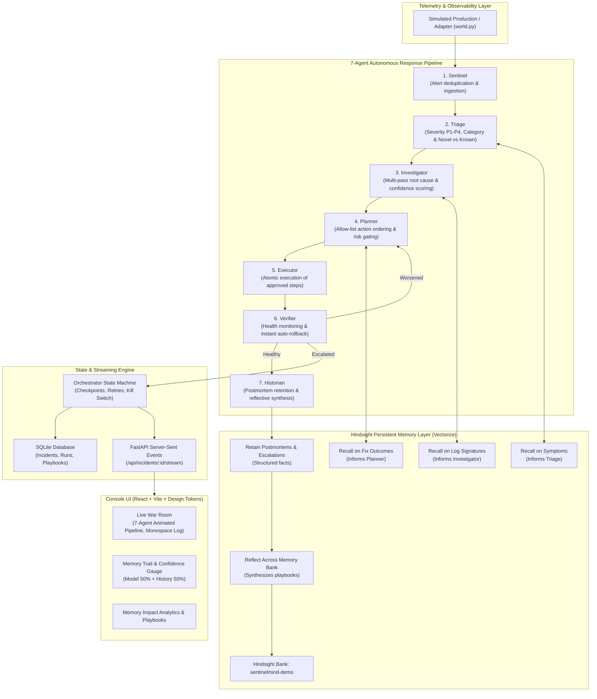

# SentinelMind: Multi-Agent AI Incident Response That Learns Using Hindsight

Built for **Hack with Hyderabad 3.0 ("AI Agents That Learn Using Hindsight")**.

SentinelMind is an autonomous incident-response command system whose core value comes from **persistent memory** powered by **Vectorize Hindsight**. Instead of treating every infrastructure outage like the first time, SentinelMind remembers past symptoms, proven remediations, and fatal mistakes—making incident resolution measurably faster, safer, and higher confidence over time.

---

## Architecture Diagram



---

## How Hindsight Is Used (Memory Is Central)

| Agent | Hindsight Operation | Query / Payload | Purpose in Incident Lifecycle |
|---|---|---|---|
| **Triage** | `recall` | Symptoms and alert signatures | Determines whether the incident matches a known past pattern or is completely novel. |
| **Investigator** | `recall` | Log excerpts and system traces | Biases diagnostic hypotheses toward historically confirmed root causes. |
| **Planner** | `recall` | `"Which actions succeeded or failed for <root cause>?"` | Prioritizes proven actions, skips failed actions, and strictly prevents repeating actions that made things worse. |
| **Historian** | `retain` | Structured postmortem facts | Retains service, symptoms, root cause, actions that SUCCEEDED, actions that FAILED, actions that made it WORSE, and minutes to resolve. |
| **Historian** | `reflect` | `"What is the most reliable fix and what should never be tried?"` | Synthesizes standing cross-incident playbooks per root cause. |
| **Orchestrator** | `retain` | Escalation facts | Retains escalated incidents so future agents learn why human intervention was needed. |

### Memory Trail & Traceability
Every memory retrieved from Hindsight that influences an agent decision is recorded as:
```json
{
  "incident_id": "INC-101",
  "service": "payments-api",
  "matched_on": "cache MISS spike after TTL cut, mass key expiry",
  "outcome": "enable_request_coalescing fixed it. restart_pods and scale_out did not.",
  "influenced": ["Triage", "Investigator", "Planner"]
}
```

### Graceful Degradation
If Hindsight is unreachable (network timeout or offline), the system retries with backoff and then automatically enters **degraded mode** (`NullMemory`). Incidents continue without crashing, and the UI displays a clear **Memory Degraded** banner.

---

## Computed Confidence Formula

Confidence is calculated by blending model reasoning with Laplace-smoothed historical success rates:

$$\text{history\_score} = \frac{\text{successes} + 1}{\text{matches} + 2}$$

$$\text{final\_confidence} = 0.5 \times \text{model\_confidence} + 0.5 \times \text{history\_score}$$

- **Cold Incident (0 past matches)**: $\text{history\_score} = \frac{0 + 1}{0 + 2} = 50\%$. If model confidence is $70\%$, final confidence is $60\%$.
- **Warm Incident (1 past match, 1 success)**: $\text{history\_score} = \frac{1 + 1}{1 + 2} = 66.7\%$. If model confidence is $90\%$, final confidence is $78.3\%$.
- **High History (8 past matches, 8 successes)**: $\text{history\_score} = \frac{8 + 1}{8 + 2} = 90\%$. Final confidence reaches $91.5\%$.

The UI exposes the complete mathematical breakdown in real time alongside an interactive **What If** slider.

---

## 10 Realistic Scenarios

| ID | Service | Problem / Symptoms | Root Cause | Effective Fix | Harmful Action (Rollback Test) | Severity / Tag |
|---|---|---|---|---|---|---|
| **INC-101** | `payments-api` | Cache miss 92%, redis timeout | `cache_stampede` | `enable_request_coalescing`, `rollback_deploy` | (none) | P2 &bull; Learning |
| **INC-102** | `catalog-service` | Redis hit 12%, Postgres CPU 97% | `cache_stampede` | `enable_request_coalescing`, `rollback_deploy` | (none) | P2 &bull; Memory Transfer |
| **INC-103** | `checkout-api` | Connection pool 20, queued 340 | `db_pool_exhaustion` | `increase_db_pool` | `scale_out` (worsens pool) | P1 &bull; Learning |
| **INC-104** | `orders-api` | Pool=25, queued=210 | `db_pool_exhaustion` | `increase_db_pool` | `scale_out` | P1 &bull; Memory Transfer |
| **INC-105** | `notifications-worker` | OOMKilled worker container pod | `memory_leak` | `restart_pods`, `rollback_deploy` | `scale_out` (starves memory) | P2 &bull; Extended |
| **INC-106** | `shipping-service` | 429 Too Many Requests from API | `downstream_rate_limit` | `enable_request_coalescing` | `scale_out` | P3 &bull; Extended |
| **INC-107** | `search-api` | Index segment hit 4%, heavy pool | `cold_search_index` | `warm_cache` | `flush_cache` (worsens cold) | P2 &bull; Extended |
| **INC-108** | `billing-service` | Deadlock on accounts_ledger | `database_lock_contention` | `failover_db` | `restart_pods` | **P1 &bull; Human Escalation** |
| **INC-109** | `telemetry-collector` | Disk IOPS saturation 99.8% | `disk_iops_saturation` | `restart_pods` | `scale_out` | P3 &bull; Extended |
| **INC-110** | `auth-gateway` | 502 Bad Gateway on /oauth/token | `bad_routing_deploy` | `rollback_deploy` | `restart_pods` | P1 &bull; Extended |

---

## Quickstart & Setup

### 1. Configure Environment (.env)
Copy the template and fill in your API credentials:
```bash
cp .env.example .env
```
Inside `.env`:
```env
LLM_PROVIDER=gemini
GEMINI_API_KEY=your_gemini_api_key_here
GROQ_API_KEY=your_groq_api_key_here
LLM_MODEL=gemini-3-flash-preview
LLM_FALLBACK_MODEL=gemini-3.1-flash-lite
HINDSIGHT_BASE_URL=https://api.hindsight.vectorize.io
HINDSIGHT_API_KEY=your_hindsight_api_key_here
RETAIN_SETTLE_S=4
```
*(Rules: `.env` is strictly git-ignored; never commit secrets).*

### 2. Verify Keys & Connectivity
Run the safe connectivity probe (never leaks keys):
```bash
python sentinelmind/check_keys.py
```

### 3. Run Automated Tests
```bash
pytest -v tests
```

### 4. Launch Application

#### Option A: Docker (Multi-Stage Containerized)
Build and run the entire full-stack application (Node 20 frontend build + Python 3.11 runtime) with Docker:
```bash
# Using Docker Compose:
docker compose up --build

# Or on Windows with 1-click script:
docker-run.bat

# Or on Linux / macOS:
./docker-run.sh
```

#### Option B: Local Development
**Windows (PowerShell):**
```powershell
powershell -File run_dev.ps1
```
**Linux / macOS:**
```bash
make dev
```
*(Or directly: `python server.py`)*

Open your browser to: **`http://127.0.0.1:8000`**

---

## Tabbed Incident Actions & Cognition Center

SentinelMind separates operational actions and cognitive traces into four focused sub-tabs:

1. **Recommended Fixes**: Ranked remediation actions synthesized from historical outcomes, paired with an explicit "Actions to Avoid" warning box highlighting past regressions.
2. **Actions Executed**: Chronological audit log of attempted actions, execution duration, and status badges (Success, Rolled Back, or Escalated).
3. **Agent Reasoning Trace**: Transparent, step-by-step cognitive reasoning across all 7 autonomous agents (Sentinel, Triage, Investigator, Planner, Executor, Verifier, Historian) showing exact hypotheses and memory correlations.
4. **Console Stream**: Real-time monospace terminal log with live SSE streaming updates, agent markers, and glowing activity cursor.

---

## Dynamic Incident Ingestion & Analysis

SentinelMind supports testing arbitrary, user-supplied production alerts, error logs, and stack traces:
- Click **+ Ingest Custom Data** in the header or incident feed.
- Choose from pre-configured templates (e.g. *Database Pool Exhaustion*, *Redis Cache Stampede*, *Worker Memory Leak*, *Downstream Rate Limit / 429 Surge*, *Financial Ledger Deadlock*, *Docker Container OOMKilled*) or paste raw telemetry logs.
- The system automatically extracts service name, severity, symptoms, and anomaly signals, runs multi-agent diagnosis via LLM or deterministic fallback, and recalls matching historical memories from Hindsight.
- **Persistence Across Sessions**: All dynamic scenarios and analysis runs are permanently persisted into SQLite (`custom_scenarios` and `runs` tables).

---

## Persistent Incident History & Audit Trail

SentinelMind provides a dedicated **Incident History** dashboard:
- **Aggregate KPI Stat Cards**: Total Runs Recorded, Time Saved % (Warm vs Cold), Baseline Cold Runs count, and Dynamic Ingested Analyses.
- **Live Search & Filter**: Real-time filtering by Incident ID, service, root cause, status (`ALL`, `WITH MEMORY`, `BASELINE (COLD)`, `RESOLVED`, `ESCALATED`, `DYNAMIC`).
- **Interactive Run Inspection**: Expand any run row to view full Root Cause Analysis, evaluated actionable recommendations with risk levels, and memory correlation breakdown.
- **Inspect in War Room**: One-click action to load any historical run directly into the 7-agent Live War Room.
- **Audit Export**: Export filtered run histories to JSON with a single click.

---

## 60-Second Demo Script

To see memory in action in under a minute:

1. **Baseline (Cold Start)**:
   - Select **INC-102** (`catalog-service`).
   - Click **Without memory** and press **Replay**.
   - Watch the agent try `restart_pods` and `scale_out` before finding `enable_request_coalescing` (17 minutes, 3 actions).
   - Select **INC-104** (`orders-api`). Notice how `scale_out` makes pool exhaustion worse, triggering an immediate **auto-rollback** before `increase_db_pool` succeeds (21 minutes, 4 actions).

2. **Learning Phase**:
   - Run **INC-101** (`payments-api`) and **INC-103** (`checkout-api`) with memory enabled.
   - The Historian agent retains the postmortems to Hindsight and reflects on root-cause playbooks.

3. **With Hindsight Memory (Warm Start)**:
   - Re-select **INC-102** and switch toggle to **With Hindsight memory**.
   - Press **Replay**.
   - Watch the agent recall INC-101, skip dead ends, and execute `enable_request_coalescing` immediately in **6 minutes** (1 action, 65% faster).
   - Re-select **INC-104** with memory. It recalls INC-103, completely avoids the harmful `scale_out`, and fixes pool exhaustion in **5 minutes** (1 action, 76% faster).
   - Review the **Memory Trail** cards and the higher **Confidence Gauge** breakdown.

4. **Human Escalation**:
   - Select **INC-108** (`billing-service`).
   - The diagnosis requires `failover_db` (high risk). The Planner gates execution and safely escalates to a human.

---

## API Endpoints Reference

- `POST /api/incidents/{id}/run?memory=on|off`: Triggers incident response.
- `GET /api/incidents`: Lists all scenarios with status and metrics.
- `GET /api/incidents/{id}`: Scenario telemetry, deploy history, and run state.
- `GET /api/incidents/{id}/stream`: Server-Sent Events (SSE) live updates.
- `GET /api/history`: Returns historical incident run checkpoints and audit logs with optional filters.
- `POST /api/incidents/custom`: Ingests and registers dynamic incident telemetry.
- `POST /api/incidents/analyze`: Analyzes raw stack traces, logs, or error text with multi-agent pipeline.
- `GET /api/memory/playbooks`: Synthesized Hindsight playbooks per root cause.
- `GET /api/stats`: Before/after resolution minutes and actions avoided.
- `GET /api/health`: Health diagnostics for LLM and Hindsight.
- `POST /api/demo/reset`: Generates a fresh unique Hindsight bank.
- `POST /api/demo/seed`: Pre-seeds baseline data for immediate presentation.
- `POST /api/kill`: Emergency kill switch stopping active runs.


